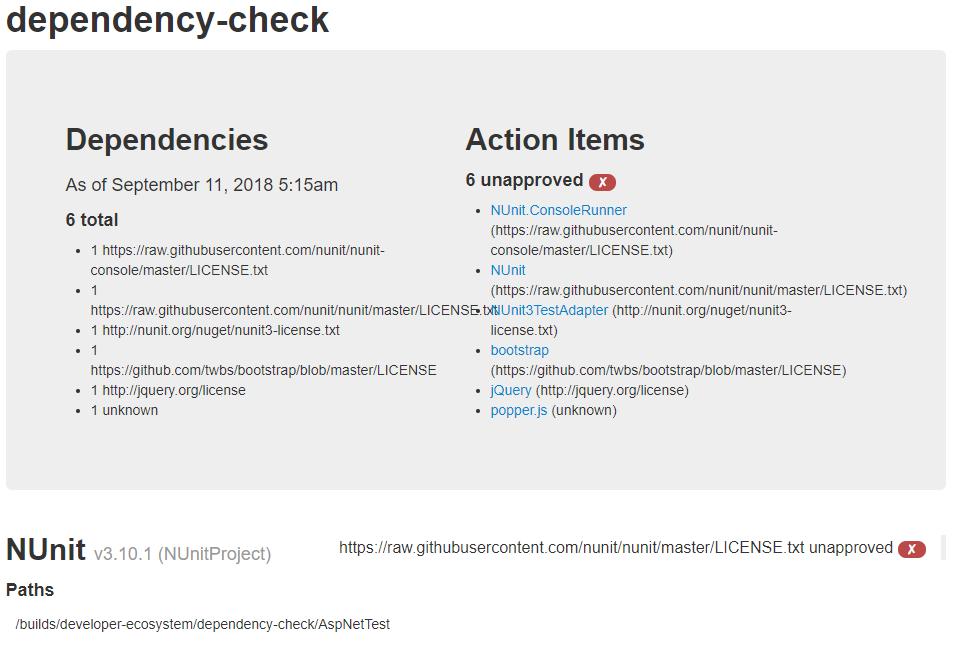

# license-check

Dockerfile to be used with tools that generate a report of the licenses used in a project's dependencies

## About project-check

The script uses [License Finder](https://github.com/pivotal-legacy/LicenseFinder) in order to
produce a report of license information for all dependencies included in the project so that we
can insure we are complying with all license requirements, are not utilizing dependencies with
inappropriate licenses, and maintaining appropriate audit data on the licenses of our code
dependencies.

## Install

`$ docker pull pmosbach/license-check`

## Usage

### Basic configuration with GitLab CI

The following is an example job from a `.gitlab-ci.yml` file to use this image to run the License
Check script against your project:

```yml
project_check:
  stage: code_analysis
  image:
    name: pmosbach/license-check:latest
    entrypoint: [""]
  script:
    - license_finder report
    - license_finder project_name add $CI_PROJECT_NAME
    - license_finder report -p --format html --save="$CI_PROJECT_DIR/license-finder-report.html"
  allow_failure: true
  artifacts:
    when: always
    paths:
      - "license-finder-report.html"
```

### Report

The job will output the test results to the command line and you can see the results in the
log of your CI job, but it will also produce an HTML report that can be captured as an artifact
(this is both recommended and included in the example job above). Here is an example of the
HTML report:



You can use environment variables to include your project's name in the test report (as shown in
the picture and example CI job).
